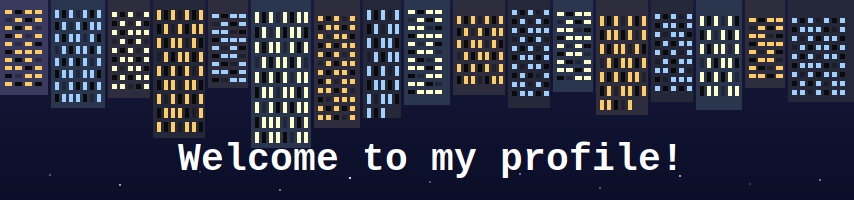

<h1 align="center">Must Try ⭐️⭐️⭐️</h1>

<table align="center" width="100%" style="border-collapse: collapse;">
  <tr>
    <td style="border: 2px solid #eaeaea; border-radius: 8px; padding: 16px;" align="center">
      <h3>✨ <a href="https://marketplace.visualstudio.com/items?itemName=DawsonHuang.shdoc">shDoc</a></h3>
      

        <b>JSDoc-style autocomplete and hover docs</b> for shell scripts. 
        💡 84+ JSDoc tags • Symbol tracking • <b>Hover intelligence</b>.
      

      

        
        
      

    </td>
  </tr>
  <tr><td style="height: 8px;"></td></tr> <tr>
    <td style="border: 2px solid #eaeaea; border-radius: 8px; padding: 16px;" align="center">
      <h3>🎮 <a href="https://www.npmjs.com/package/less-pager-mini">Less-Pager-Mini</a></h3>
      

        A <b>blazing-fast CLI pager</b> inspired by Unix <code>less</code>. 
        🌀 Smooth scrolling • ANSI colors • Resize handling • <b>Zero lag</b>.
      

      

        
        
      

    </td>
  </tr>
</table>

<h1 align="center">Hi👋I'm Dawson</h1>
<h3 align="center">Computer Science Student @ <a href="https://www.unsw.edu.au">UNSW</a></h3>

I'm a passionate developer who loves building innovative solutions and exploring new technologies. I believe in writing clean, maintainable code and creating applications that make a difference.

🔭 **Currently Working On:** My side projects and expanding my knowledge in web development  
🌱 **Learning:** Making fancy websites and integrating AI into my development routine  
😎 **Fun Fact:** Moon gives me programming power 🧑‍💻🎑

## 🤝 Connect With Me

## 🛠️ Tech Stack

---
  
### Thanks for visiting! 😄

*"Genius code doesn't ask permission—it just compiles at 3 AM."*

